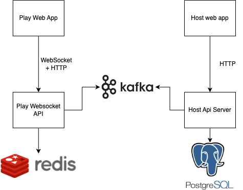

# Kapo

<!--  center  -->

<p align="center">
  
  <br>

<p align="center">
  Demo of Kapo
</p>

## Introduction

**Kapo** is a real-time, interactive online learning platform where educators create and share quizzes, surveys, and discussions. Widely used in classrooms and corporate training, it engages learners through fun, competitive gameplay on their devices, promoting active participation and immediate feedback.

## Main features

1. **Quiz Creation**: Educators can create custom quizzes with multiple-choice questions, true/false questions, polls, and surveys.

2. **Real-Time Gameplay**: Kapo games are played in real-time, allowing participants to answer questions on their own devices while the results are displayed instantly on a shared screen.

3. **Interactive Learning**: The platform promotes active learning through gamification, fostering engagement and participation.

4. **Accessibility**: Kapo is accessible across various devices, including smartphones, tablets, and computers, making it easy for participants to join from anywhere.

5. **Feedback and Assessment**: Participants receive immediate feedback on their answers, and educators can assess learning outcomes through detailed reports and analytics.

6. **Collaborative Learning**: Kapo supports team modes and discussions, encouraging collaboration and peer-to-peer learning.

7. **Customization**: Educators can customize quizzes with images, videos, and other multimedia elements to suit their teaching objectives.

8. **Community and Sharing**: Users can access a library of publicly shared Kapo quizzes created by other educators, promoting collaboration and resource sharing.

## Architecture

<p align="center">
  
  <br>
</p>

## Tech stack

- **Front end**: ReactJS, Websocket, TailwindCSS

- **Back end**: Golang, Gorm, Gin, gorilla/websocket
- **Database/Cloud**: PostgreSQL, Redis
- **Message broker**: Kafka

## Components Description

- **Play web app**: The front-end application for participants to join and play quizzes.
- **Play websocket API**: The back-end server that handles real-time communication with the play web app.
- **Host API**: The back-end server for educators to create, manage, and host quizzes.
- **PostgreSQL**: The main database for storing user and quiz data.
- **Redis**: The cache for storing real-time game data to reduce latency.
- **Kafka**: The message broker for handling real-time communication between the play real-time server and the host API.

## Run the project

- Clone the [user play web repo](https://github.com/ddatdt12/kapo-play-web/), [play websocket server](https://github.com/ddatdt12/kapo-play-ws-server) and [admin server](https://github.com/ddatdt12/kapo-host-api)
- Requiments:
  - Go 1.2x
  - NodeJS 18.x
  - PostgreSQL 16.x
- Set up postgresql and redis
- Run the websocket server

  ```bash
  go run main.go wire_gen.go
  ```

- Run the host api

  ```bash
  go run ./cmd/app/main.go
  ```

- Run play web app

  ```bash
  yarn start
  ```

## Feedback

Create a feedback in [Issues](https://github.com/ddatdt12/kapo/issues) section, each of your feedback will help us improve the app. Thank you once again for your assistance!
